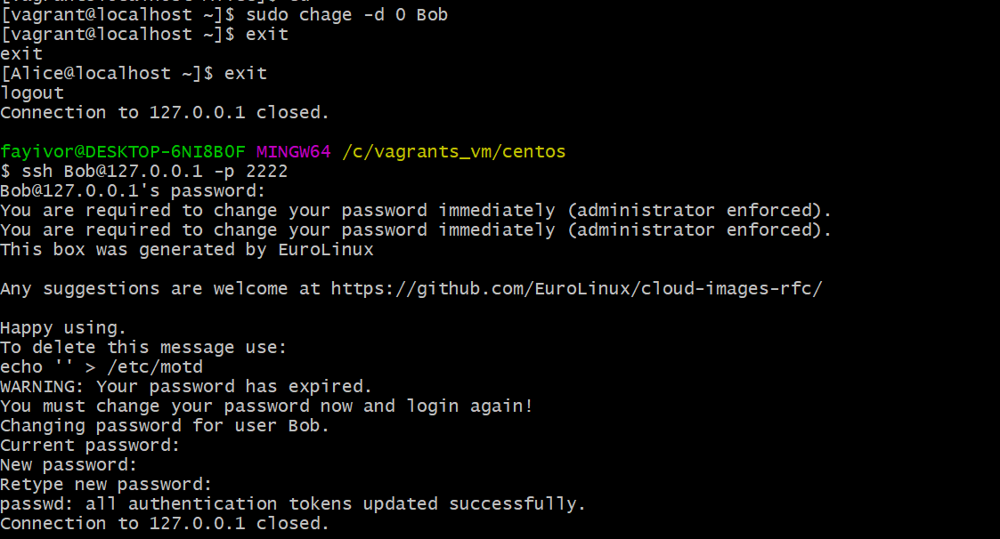

## User Creation:
### Create users for 5 new employees: Alice, Bob, Charlie, Dave, and Eve.

```
sudo useradd Alice
```
```
sudo useradd Bob
```
```
sudo useradd Charlie
```
```
sudo useradd Dave
```
```
sudo useradd Eve
```
### Set up strong passwords for each user and ensure they change it at the first login.

To set strong passwords for each user:
```
sudo passwd Alice
```
```
sudo passwd Bob
```
```
sudo passwd Charlie
```
```
sudo passwd Dave
```
```
sudo passwd Eve
```

To ensure they change their passwords at the first login, you can use ``` chage ``` command:

```
sudo chage -d 0 Alice
```
```
sudo chage -d 0 Bob
```
```
sudo chage -d 0 Charlie
```
```
sudo chage -d 0 Dave
```
```
sudo chage -d 0 Eve
```

From the image below, we can see Bob is asked to change password at first login



