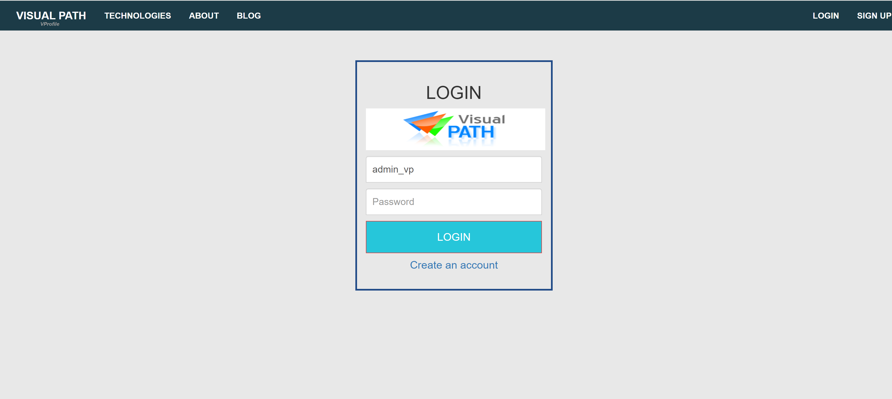
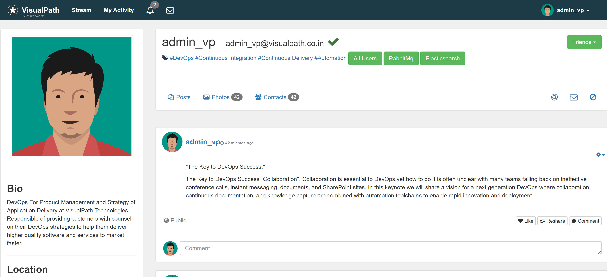

# Vprofile Docker Project
For the Docker project, simply download the docker-compose.yml file to your local machine or cloud server where Docker Engine is installed and running.
```
wget https://raw.githubusercontent.com/techlearn-center/DevOps/docker/vprofile-project/docker-compose.yml
```
Next, run the following command to start all the containers in detached mode:

```
docker-compose up -d
```

- If you are running the project on your local machine, open a browser and navigate to ```localhost:<port-number_of_vprofileapp>```.
- If you are running the project on an EC2 server, use the public IP address of the EC2 instance along with the port number, like so: ```http://<public-ip>:<port-number_of_vprofileapp>```.
The username and password for login are:

- Username: admin_vp
- Password: admin_vp

This is what you should get when all containers are all up and running



Below is the image of the home page when you login with the username and password above



To cleanup you need to bring down all containers and delete all images, run the following:
```
docker compose down
```

```
docker system prune -a
