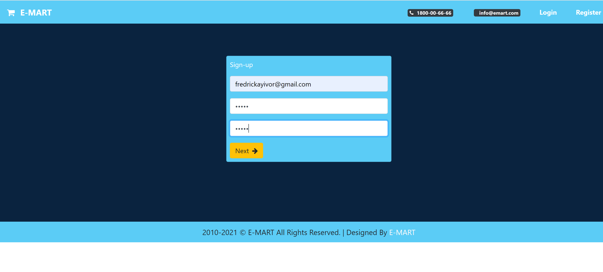

# Microservice Application Running on Docker Platform- emart-app

### Steps
- Clone the emart-app directory to your local machine or cloud server where Docker Engine is installed.
- Make sure the client sub-directory is present.
- Navigate to the emartappp directory containing the docker-compose file by running ``` cd emart-app```
- Run the following command to start the containers in detached mode:
  ```
  docker compose up -d
  ```

 It takes approximately 7 minutes for all containers to be up and running. 
 
 if you are running the containers on your local machine then go to your browser and type ```localhost``` 

 if it's on a virtual or cloud server, get the Ip of the server and paste it in the browser

 You should see the image below:

 

Click on register to signup as seen below:




