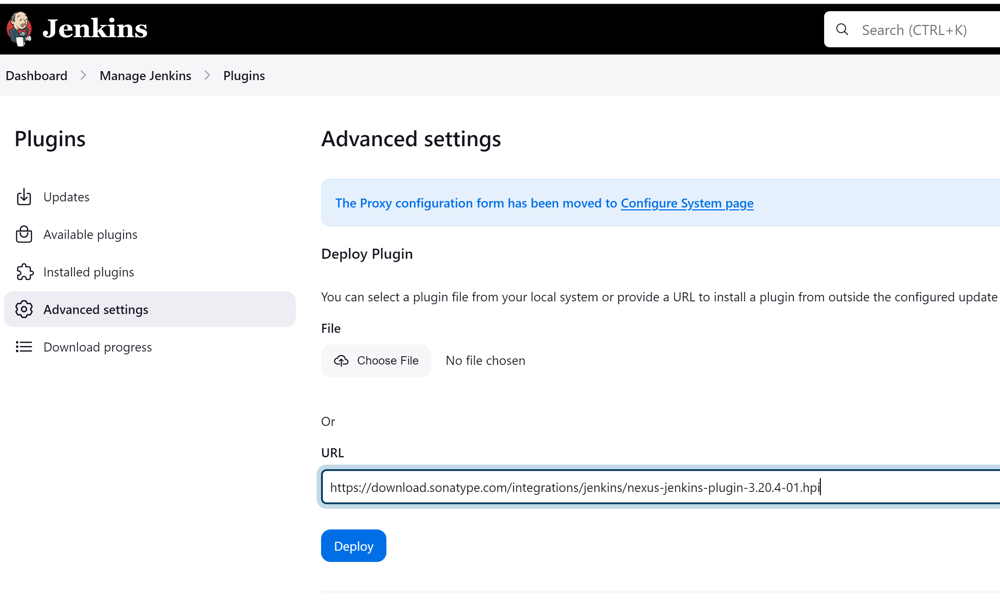
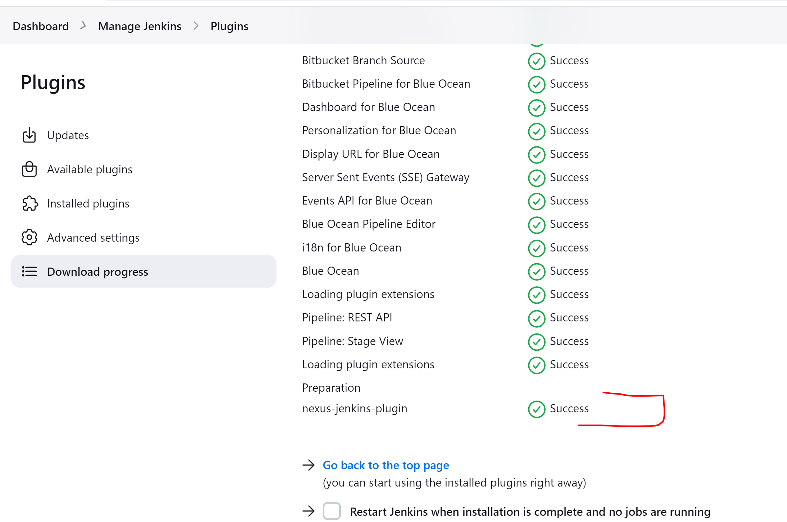
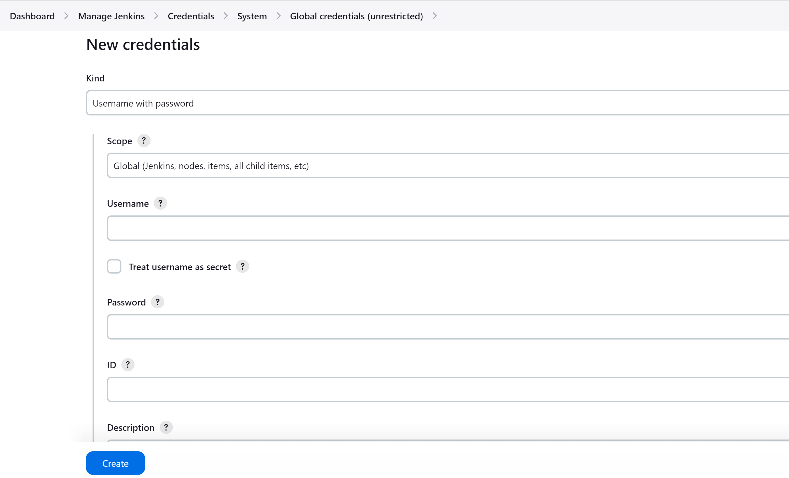
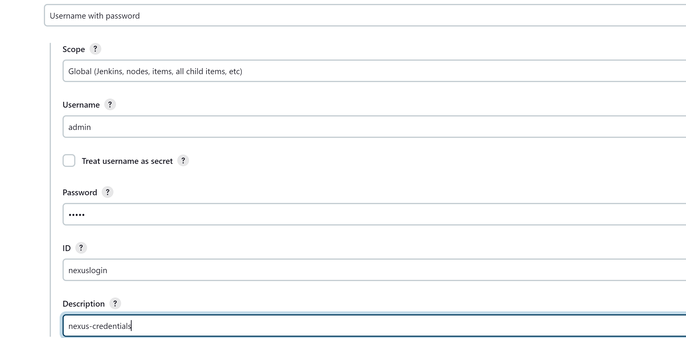
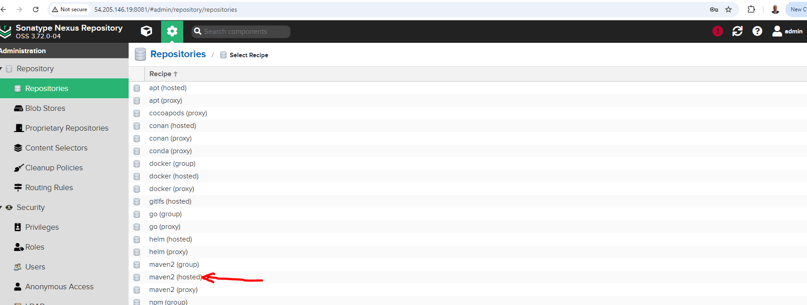
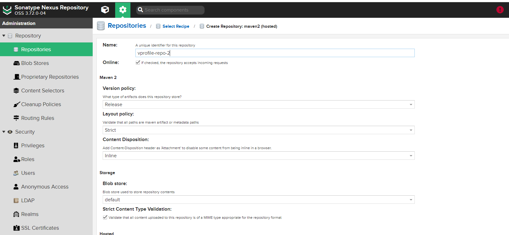

### Ensure Nexus is Up and Running (follow this step https://github.com/techlearn-center/DevOps/tree/Terraform/exercise7-instance-ubuntu)

1. **Install Sonatype Nexus Plugin for Jenkins:**

   Since Jenkins does not have a built-in Nexus plugin, we need to manually deploy the Sonatype Nexus plugin.

   - Navigate to **Manage Jenkins** >**Plugins**>**Advanced Settings**.
   - Add the following URL:  
     [Nexus Jenkins Plugin 3.20.4-01](https://download.sonatype.com/integrations/jenkins/nexus-jenkins-plugin-3.20.4-01.hpi)
   - This URL was retrieved from Sonatype’s official documentation.  
     More details here: [Sonatype Nexus Jenkins Integration](https://help.sonatype.com/en/sonatype-platform-plugin-for-jenkins.html)
   - After entering the URL, click **Deploy**.

 

2. **Verify Nexus Plugin Installation in Jenkins:**

   - Go to **Manage Jenkins** > **System Settings**.
   - Search for **Nexus** to verify that the plugin is installed successfully.

- Configure Nexus by adding the following:
     - **Display Name**: Same name as referenced in the `Jenkinsfile`.
     - **Server ID**: Use the same value as the **Display Name**.
     - **Server URL**: Enter the URL of your Nexus instance (e.g., `http://nexus-server:8081`).
     - **Credentials**: Use the credentials configured in **Step 3**.

3. **Set Up Jenkins Credentials for Nexus Authentication:**

   - To enable Jenkins to authenticate to Nexus and upload artifacts, you need to add credentials in Jenkins.
   - Go to **Manage Jenkins** > **Credentials**.
   - Click on **System** > **Global credentials (unrestricted)**.
   - Add a new domain, then choose **Username/Password** for the credentials and complete the required details.

4.  **Create the Repository in Nexus**:  
   Proceed to your Nexus server and create the necessary repository (e.g., Maven, NPM, or Docker).  
   - Go to **Repositories** -> **Create repository**, and select the appropriate type of repository (e.g., Maven hosted).

   - When creating the repository, ensure that the repository name matches exactly what you have specified in the Jenkinsfile under the `repository URL` section to avoid any issues during artifact deployment.

