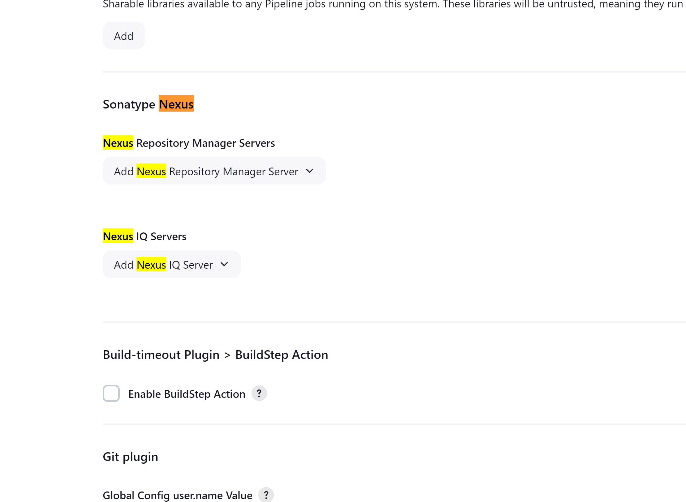
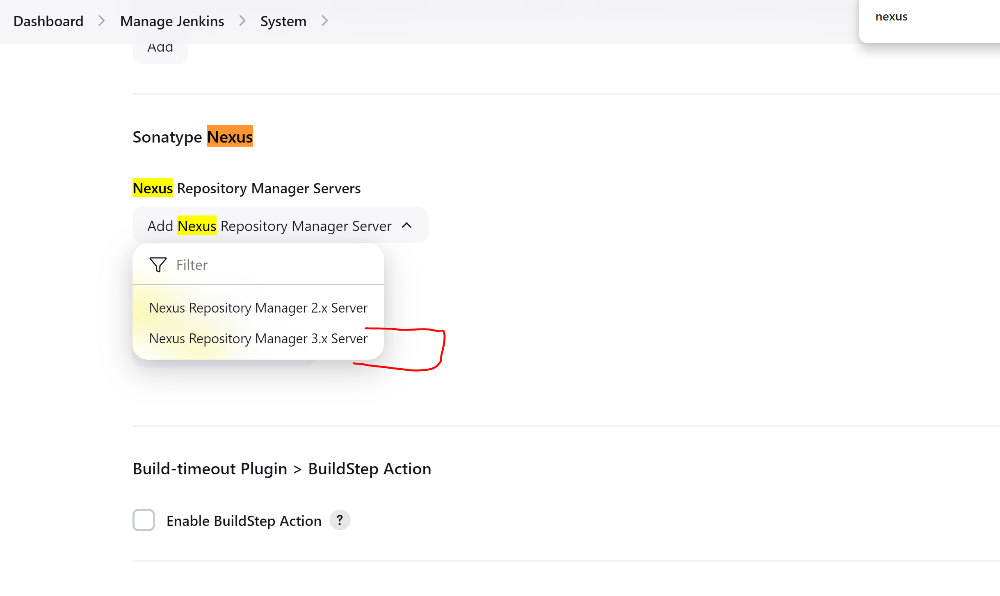
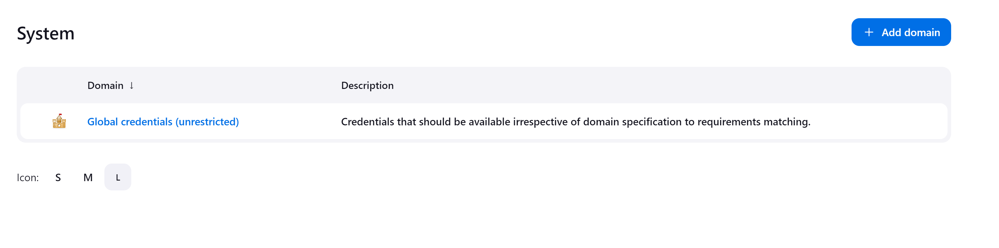

### Ensure Nexus is Up and Running

1. **Install Sonatype Nexus Plugin for Jenkins:**

   Since Jenkins does not have a built-in Nexus plugin, we need to manually deploy the Sonatype Nexus plugin.

   - Navigate to **Manage Jenkins** > **Advanced Settings**.
   - Add the following URL:  
     [Nexus Jenkins Plugin 3.20.4-01](https://download.sonatype.com/integrations/jenkins/nexus-jenkins-plugin-3.20.4-01.hpi)
   - This URL was retrieved from Sonatype’s official documentation.  
     More details here: [Sonatype Nexus Jenkins Integration](https://help.sonatype.com/en/sonatype-platform-plugin-for-jenkins.html)
   - After entering the URL, click **Deploy**.

 

2. **Verify Nexus Plugin Installation in Jenkins:**

   - Go to **Manage Jenkins** > **System Settings**.
   - Search for **Nexus** to verify that the plugin is installed successfully.

3. **Set Up Jenkins Credentials for Nexus Authentication:**

   - To enable Jenkins to authenticate to Nexus and upload artifacts, you need to add credentials in Jenkins.
   - Go to **Manage Jenkins** > **Credentials**.
   - Click on **System** > **Global credentials (unrestricted)**.
   - Add a new domain, then choose **Username/Password** for the credentials and complete the required details.

